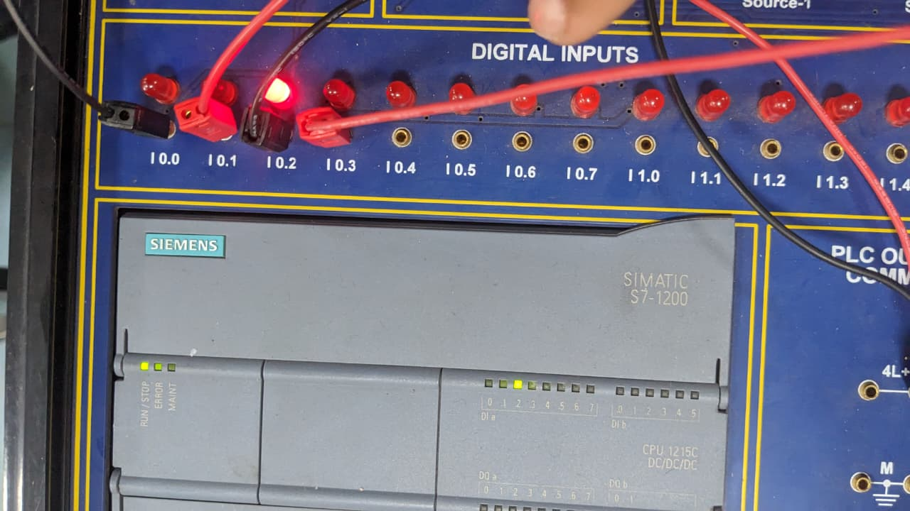
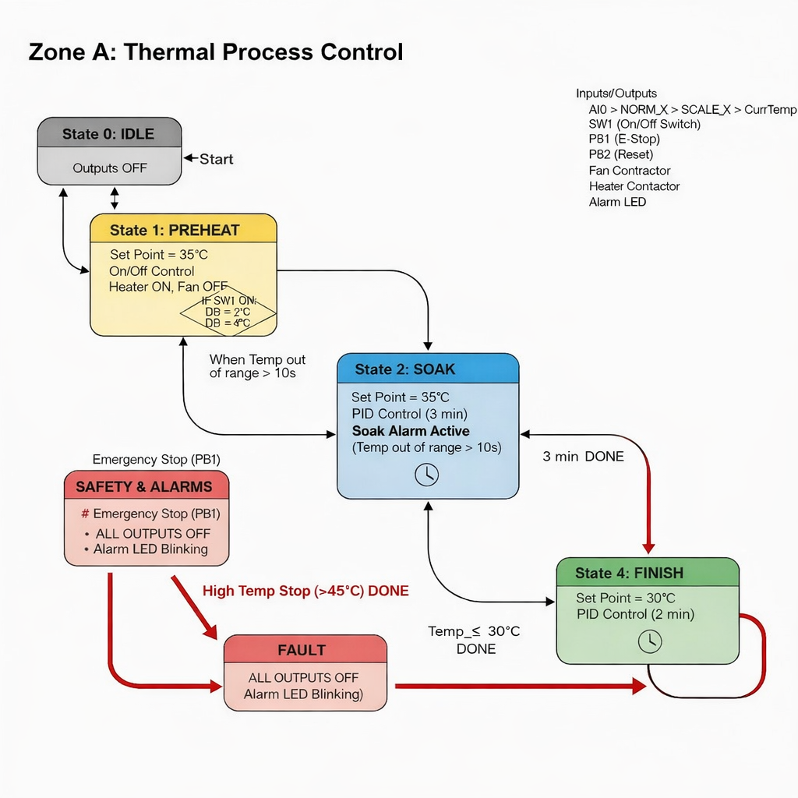
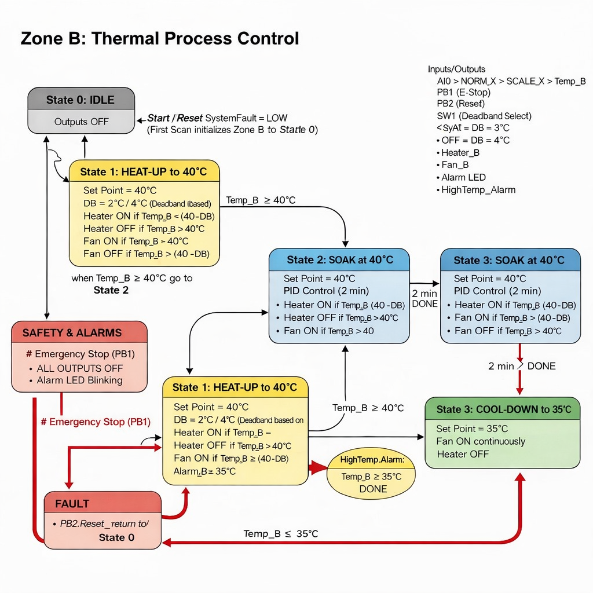
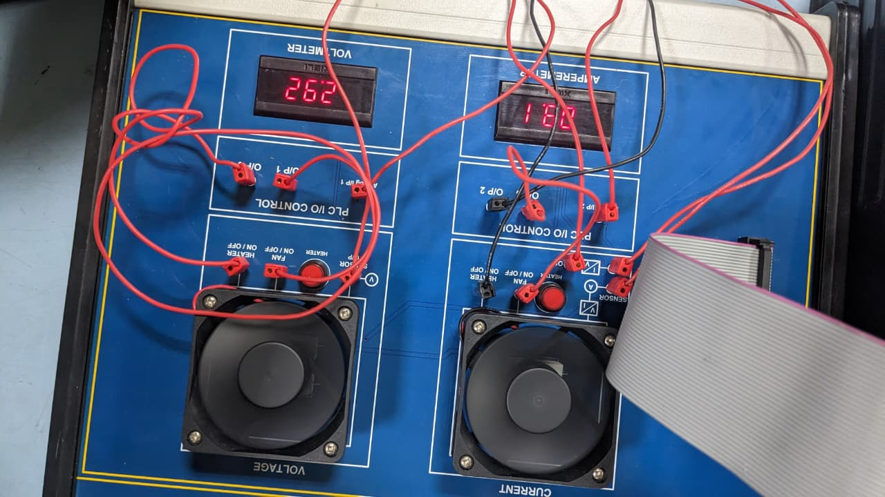
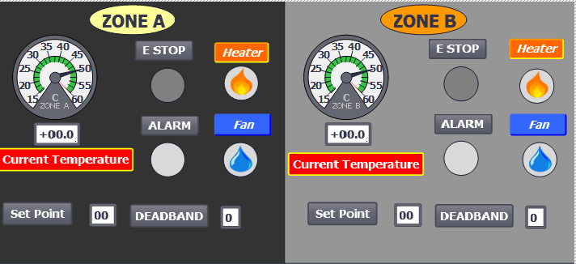

# 🔥 Dual-Zone Industrial Thermal Process Controller  
### Siemens S7-1200 PLC (TIA Portal)

This project implements a **dual-zone thermal control system** using a **Siemens S7-1200 PLC**, designed for industrial applications such as material curing, thermal processing, and testing systems.

---

## 📌 System Overview

The system consists of two independently controlled thermal zones:

- **Zone A (Voltage-based temperature feedback 0–10V)**
- **Zone B (Current-based temperature feedback 4–20mA)**

Both zones operate **simultaneously** and follow a defined **thermal recipe**:
- Ramp
- Soak
- Cooling
- Stabilization

---

## 🖼️ Hardware Setup

The setup below shows the **heater and cooling fans installed for both zones**:

---

## ⚙️ Control System

Each zone includes:
- 🔥 Heater (heating element)
- 🌬️ Cooling fan
- 🌡️ Analog temperature feedback

### 🔹 Control Algorithm (PID + Deadband)

Using **TIA Portal PID Compact**:

- Heater ON → Temp < (Setpoint − Deadband)  
- Heater OFF → Temp ≥ Setpoint  
- Fan ON → Temp > (Setpoint + Deadband)  

❗ Heater and Fan are **interlocked** (never ON together)

---

## 🔄 Flowcharts

### 🔹 Zone A Flowchart

### 🔹 Zone B Flowchart

---

## 🧪 Simulation

Simulation of both zones showing heater and fan control:

---

## 🖥️ HMI / Monitoring

The HMI provides real-time monitoring:

- Temperature of both zones  
- Heater status (ON/OFF)  
- Fan status (ON/OFF)  
- Alarm indication  
- Emergency stop status  

---

## 🔐 Safety Features

- 🚨 High Temperature Alarm (>45°C)
  - Heater OFF immediately
  - Fan runs until safe level (~25°C)
- 🛑 Emergency Stop
  - All outputs OFF
  - System latched until reset
- ⚠️ Soak Monitoring
  - If temperature deviates ±2°C for >10s → Alarm

---

## 🎛️ Operator Interface

- **SW1** → High Accuracy Mode (Deadband = 2°C)  
- **SW2** → Overtemperature Test Mode  
- **PB1** → Emergency Stop  
- **PB2** → Alarm Reset  

---

## 🛠️ Technologies Used

- Siemens S7-1200 PLC  
- TIA Portal  
- PID Compact Controller  
- Analog I/O (Voltage & 4–20mA)  
- Ladder Logic / FBD  

---

## 📊 Applications

- Industrial thermal processing  
- Material curing systems  
- Chemical process control  
- Temperature testing setups  

---

## 👨‍💻 Author

Ahsan Abdullah  
